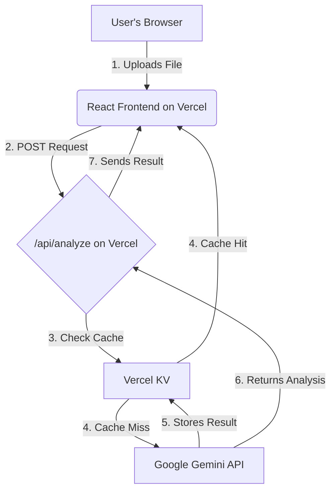
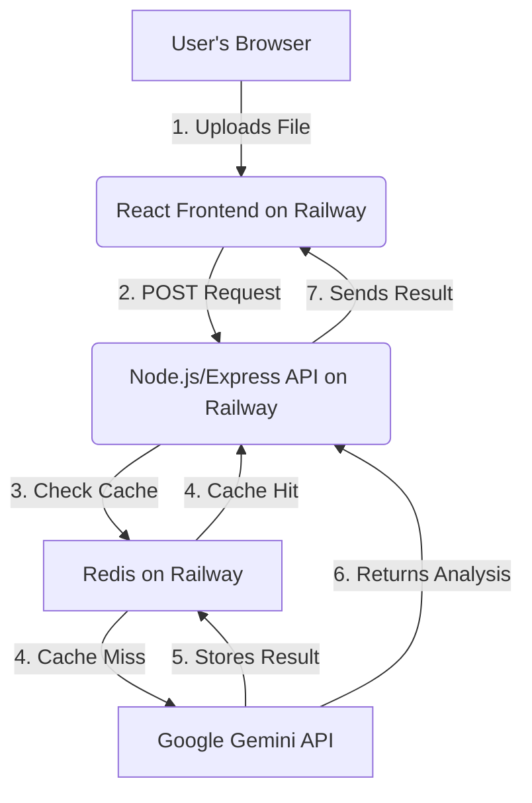

# Deployment & Hosting Analysis

This document outlines and compares various deployment and hosting options for the RMN Analyst project.

## Core Requirements

1.  **Frontend Hosting**: The platform must host a static React application built with Vite.
2.  **Backend API**: A server-side component is required to securely manage the Google Gemini API key and handle analysis requests.
3.  **Caching**: To avoid re-running queries, a caching mechanism is needed to store and retrieve previous analysis results.

---

## Option 1: Vercel

Vercel is a popular platform for hosting frontend applications, with excellent support for serverless functions.

*   **Pros**:
    *   **Seamless Git Integration**: Automatic deployments on every push to `main`.
    *   **Serverless Functions**: Easily create a backend API to protect your API key.
    *   **Vercel KV**: A simple and effective key-value store for caching analysis results.
    *   **Generous Free Tier**: Ideal for personal projects and startups.

*   **Cons**:
    *   **Vendor Lock-in**: Caching with Vercel KV ties you to their ecosystem.

### Proposed Architecture on Vercel

---

## Option 2: Railway

Railway is a flexible platform that allows you to deploy multiple services (frontend, backend, database) in a single project.

*   **Pros**:
    *   **All-in-One Solution**: Host your frontend, backend, and a Redis database for caching in one place.
    *   **Simple Configuration**: Easy to set up and manage multiple services.
    *   **Usage-Based Pricing**: Pay only for what you use, with a free trial to start.

*   **Cons**:
    *   **Can Be More Expensive**: Costs can increase as your usage grows.

### Proposed Architecture on Railway

---

## Option 3: Streamlit Community Cloud

Streamlit is a Python-native framework for building data applications, but it's not suitable for hosting a React frontend.

*   **Pros**:
    *   **Built-in Caching**: Streamlit's `@st.cache_data` makes caching incredibly simple.
    *   **Ideal for Data Science**: Perfect for Python-based data analysis and visualization.

*   **Cons**:
    *   **Not for React**: You would need to rewrite your entire application in Python.
    *   **Less Flexible**: Primarily designed for data apps, not general web applications.

---

## Recommendation

Both **Vercel** and **Railway** are excellent choices for this project.

*   Choose **Vercel** if you prefer a streamlined, frontend-focused platform with a simple, integrated caching solution.
*   Choose **Railway** if you want an all-in-one solution that gives you more control over your backend and database.

Given its simplicity and powerful features, **Vercel is the recommended option**.

Please review this analysis and let me know which direction you'd like to take. Once we've decided on a platform, I'll create a detailed implementation plan.