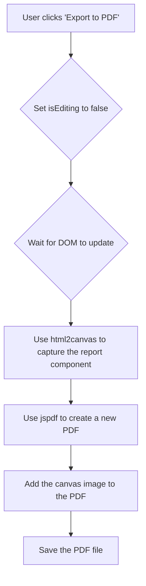

# Editable Report Architecture

This document outlines the architecture for the editable report and PDF export feature.

## 1. State Management

We will introduce two new state variables in the `AnalysisDisplay` component:

-   `isEditing`: A boolean that toggles "Edit Mode."
-   `editableAnalysis`: A copy of the `analysis` prop that will be updated as the user makes changes.

When the component mounts, `editableAnalysis` will be initialized with the data from the `analysis` prop.

## 2. Component Structure

We will create a new reusable component called `EditableField`.

### `EditableField` Component

-   **Props**:
    -   `value`: The text content to be displayed.
    -   `isEditing`: A boolean to determine if the field should be in edit mode.
    -   `onChange`: A function to call when the text content is changed.
-   **Logic**:
    -   If `isEditing` is `true`, it will render a `<textarea>` with the current `value`.
    -   If `isEditing` is `false`, it will render a `
` tag with the `value`.

## 3. "Edit Mode" Workflow

The `AnalysisDisplay` component will be updated to include an "Edit" button.

1.  **Toggle Edit Mode**: Clicking the "Edit" button will set `isEditing` to `true`. This will switch all `EditableField` components to their `textarea` state.
2.  **Update State**: As the user types in a `textarea`, the `onChange` handler will update the corresponding field in the `editableAnalysis` state object.
3.  **Save Changes**: When the user clicks "Save," `isEditing` will be set to `false`, and the `EditableField` components will revert to displaying `
` tags with the updated content.

## 4. PDF Export Workflow

Here's how the PDF export will work:

This architecture allows us to reuse the existing `AnalysisDisplay` component, add editing functionality with minimal changes, and generate a PDF that is a perfect replica of the on-screen report.